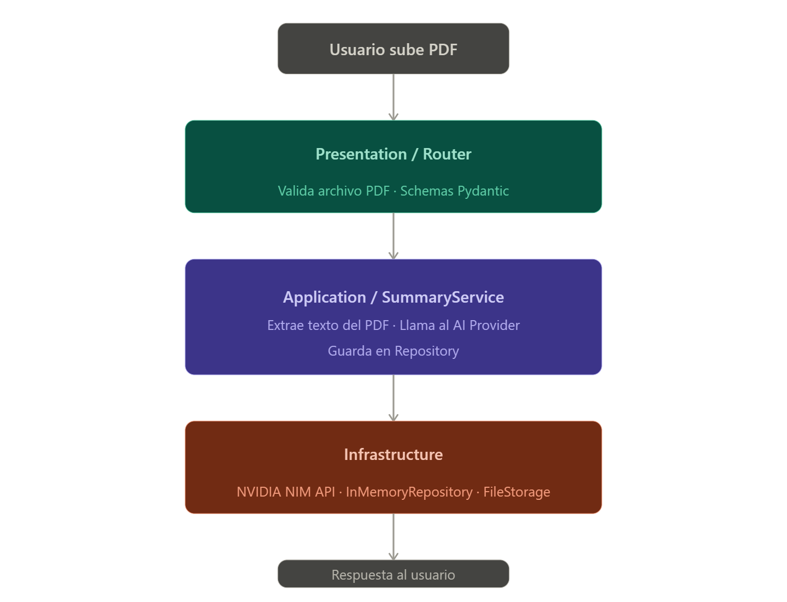

## Arquitectura implementada:

| Capa | Componentes |
|---|---|
|`Presentation` | routers/pdf_summary.py, schemas/pdf_summary.py, templates/index.html
|`Application` | services/pdf_service.py, services/summary_service.py, interfaces/ai_provider.py, interfaces/summary_repository.py
|`Infrastructure`	| external/openrouter_client.py, repositories/mongo_repository.py, repositories/in_memory_repository.py, file_storage/file_handler.py
|`Core` | core/__init__.py (Settings)

## Estructura de las carpetas

| Carpeta | Propósito |
|---|---|
| `application/interfaces` | Define qué operaciones existen (`AIProvider`, `SummaryRepository`) sin especificar cómo. Contiene también el modelo `Summary` |
| `application/services` | Coordina la lógica (subir PDF → extraer texto → enviar a IA → guardar resumen) |
| `core` | Configuración global: la clase `Settings`, que lee el `.env` |
| `infrastructure/external` | Conexión real con el proveedor de IA (OpenRouter) |
| `infrastructure/file_storage` | Guardar PDFs en disco o cloud storage |
| `infrastructure/repositories` | Persistencia de resúmenes en BD |
| `presentation/routers` | Rutas HTTP (`/api/summarize`, `/api/summaries/{id}`) |
| `presentation/schemas` | Validación de datos de entrada/salida |
| `presentation/templates` | HTML del frontend |

## Capa de Presentación (`app/presentation/`)

**Responsabilidad:** Interfaz con el cliente (usuario o sistema externo).

| Componente | Propósito |
|---|---|
| `routers/` | Define endpoints HTTP (GET, POST). Recibe requests y devuelve respuestas. |
| `schemas/` | Validación de datos de entrada/salida con Pydantic. |
| `templates/` | Plantillas HTML para la interfaz web. |

**Principio:** Solo maneja transporte, nunca lógica de negocio.

## Capa de Aplicación (`app/application/`)

**Responsabilidad:** Reglas de negocio y casos de uso.

| Componente | Propósito |
|---|---|
| `services/` | Lógica de negocio. Ej: `SummaryService` orquestra extracción + IA + persistencia. |
| `interfaces/` | Contratos (abstractos) que definen qué debe hacer cualquier implementación. |

**Principio:** No sabe cómo se persisten datos ni cómo se llama a la IA. Solo conoce las interfaces.

## Capa de Infraestructura (`app/infrastructure/`)

**Responsabilidad:** Implementaciones concretas de las interfaces.

| Componente | Propósito |
|---|---|
| `external/` | Cliente HTTP para OpenRouter API. |
| `repositories/` | Persistencia de resúmenes. `MongoSummaryRepository` es la implementación en uso; `InMemorySummaryRepository` se mantiene para pruebas. |
| `file_storage/` | Manejo de archivos subidos (guardar, leer, eliminar). |

**Principio:** Puede cambiarse completamente sin afectar capas superiores.

## Capa Core (`app/core/`)

**Responsabilidad:** Configuración global y settings.

| Componente | Propósito |
|---|---|
| `__init__.py` | Settings de la aplicación (API keys, rutas, límites). Lee variables de entorno. |

**Principio:** No contiene lógica ni modelos de dominio, solo configuración. Cualquier capa puede leerla, pero nunca escribirla.

## Visualización

