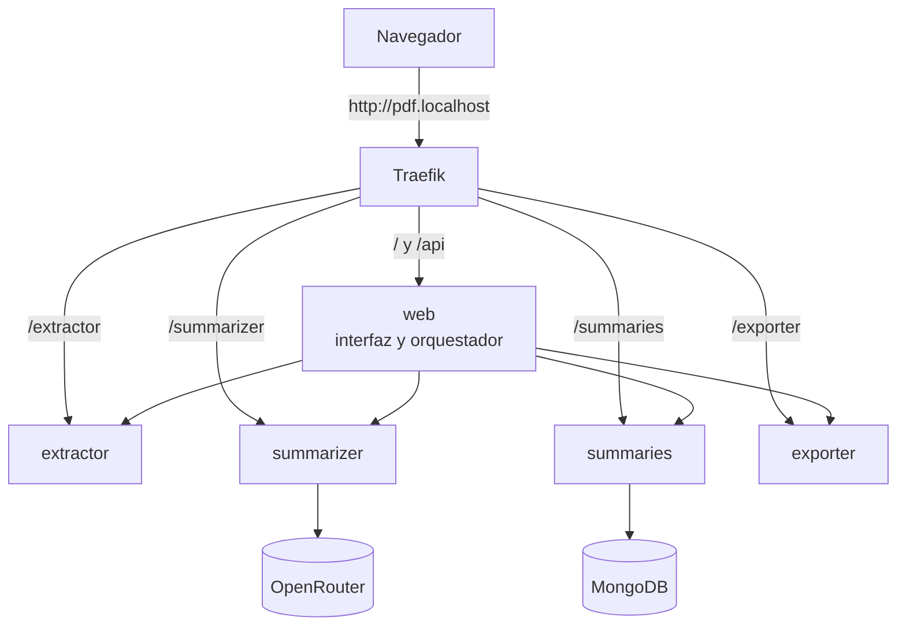
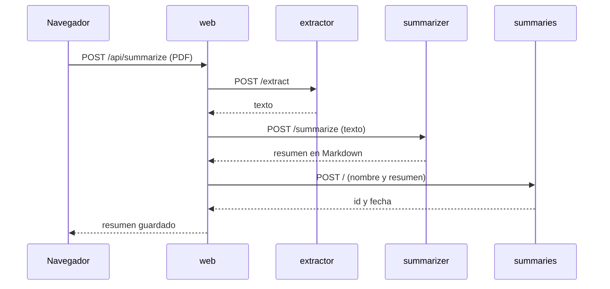

# Arquitectura de pdf-extractext

## Microservicios

Cada servicio hace una sola cosa, vive en su propio repositorio y corre en su propio
contenedor. Se comunican por HTTP dentro de la red de Docker.

```mermaid
flowchart TD
    N[Navegador] -->|http://pdf.localhost| T[Traefik]
    T -->|/ y /api| W[web<br/>interfaz y orquestador]
    T -->|/extractor| E[extractor]
    T -->|/summarizer| S[summarizer]
    T -->|/summaries| H[summaries]
    T -->|/exporter| X[exporter]
    W --> E
    W --> S
    W --> H
    W --> X
    S --> O[(OpenRouter)]
    H --> M[(MongoDB)]
```

| Servicio | Responsabilidad | Única dependencia externa |
|---|---|---|
| **web** | Sirve la interfaz y coordina a los demás | Los otros cuatro servicios |
| **extractor** | Extrae el texto de un PDF | `pypdf` |
| **summarizer** | Genera el resumen | OpenRouter; es el único con la API key |
| **summaries** | Guarda, lista, consulta y borra resúmenes | MongoDB; es el único que lo toca |
| **exporter** | Convierte el Markdown en un `.docx` | `python-docx` y `markdown-it-py` |

### Traefik

Traefik es la **única puerta de entrada** y lo único que publica puertos en la máquina
(80 para la aplicación, 8080 para su panel). Enruta por prefijo y lo quita antes de
reenviar: `/extractor/health` llega al extractor como `/health`, así que ningún
servicio sabe que existe Traefik. Descubre los servicios leyendo las etiquetas de sus
contenedores en el `docker-compose.yml`.

Entre ellos, los servicios se hablan por la red interna (`http://extractor:8000`), sin
pasar por Traefik.

### MongoDB

Solo `summaries` habla con MongoDB. Si otro servicio necesita un resumen, se lo pide a
`summaries` por HTTP. Mongo arranca con usuario y contraseña, no publica su puerto y
guarda los datos en un volumen de Docker.

## Flujo de una petición: subir un PDF

```mermaid
sequenceDiagram
    participant N as Navegador
    participant W as web
    participant E as extractor
    participant S as summarizer
    participant H as summaries
    N->>W: POST /api/summarize (PDF)
    W->>E: POST /extract
    E-->>W: texto
    W->>S: POST /summarize (texto)
    S-->>W: resumen en Markdown
    W->>H: POST / (nombre y resumen)
    H-->>W: id y fecha
    W-->>N: resumen guardado
```

Si un paso falla, los siguientes no se ejecutan: un PDF sin texto no llega a la IA, y
si la IA falla no se guarda nada. El mensaje del servicio que falló llega tal cual al
usuario. Si un servicio no responde, `web` devuelve `502` diciendo cuál; si tarda
demasiado, `504`.

## Capas dentro de cada servicio

Los cinco servicios siguen la misma estructura:

| Capa | Carpeta | Contiene |
|---|---|---|
| Presentación | `app/presentation/` | Routers y schemas de FastAPI |
| Aplicación | `app/application/` | Casos de uso, puertos (interfaces) y entidades. No importa librerías externas |
| Infraestructura | `app/infrastructure/` | Adaptadores de los puertos: `pypdf`, OpenRouter, MongoDB, `python-docx`, clientes HTTP |
| Configuración | `app/core/` | `Settings`, leído de variables de entorno |
| Cableado | `app/dependencies.py` | Construye las dependencias. Lo importan los routers y `main`, así que no hay import circular |

Las dependencias apuntan hacia dentro: la infraestructura implementa los puertos que
define la aplicación. Por eso los tests sustituyen cada adaptador por un doble y corren
sin red, sin base de datos y sin API key.

## Decisiones

- **Un repositorio por servicio** y uno más para la orquestación: cada servicio se
  prueba, se construye y se publica por separado.
- **Comunicación por HTTP síncrono.** Una cola de mensajes añadiría infraestructura
  sin que el flujo la necesite.
- **`web` como orquestador (BFF).** El navegador no conoce la topología ni encadena
  llamadas.
- **Las reglas de Traefik viven en el `docker-compose.yml`**, no en los servicios.
- **Traefik v3.6.** La v3.5 no detecta servicios con Docker Engine 29.
- **Proveedor de IA: OpenRouter.** Sustituyó a NVIDIA NIM porque se accede con una
  simple API key, sin hardware propio, y ofrece modelos gratuitos. Cambiar de
  proveedor solo exige otra implementación del puerto `AIProvider` en `summarizer`.
- **El monolito anterior** se conserva en la etiqueta `monolito-v1` de este repositorio.
